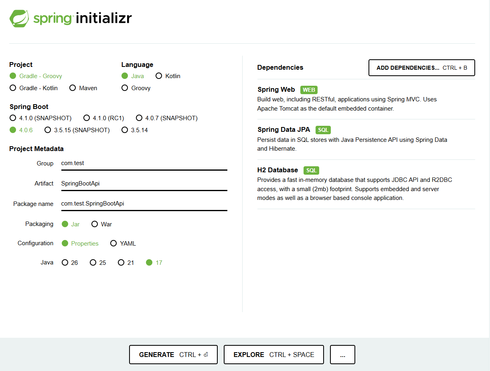

# Week 05 - 웹의 동작 원리와 Spring Boot CRUD API

이번 주차에는 **웹이 동작하는 기본 원리**와 **Spring Boot를 활용한 Product CRUD API 실습**을 학습했습니다.

---

## 📌 학습 내용

| 구분 | 내용 |
|---|---|
| 웹 기초 | 웹의 발전 과정, 클라이언트와 서버 |
| HTTP / URL | HTTP 통신 규칙, URL 구성 요소 |
| 상태 관리 | 쿠키, 세션, HTTP의 무상태성 |
| 네트워크 | IP, 포트, DNS |
| Spring Boot | 웹 애플리케이션 프레임워크, 내장 톰캣 |
| CRUD API | Product 생성, 조회, 수정, 삭제 |
| Database | H2 Database, JPA, Repository |

---

# Part 1. 웹의 동작 원리

## 🌐 웹의 발전 과정

웹은 PC와 초고속 인터넷의 보급 이후 빠르게 발전했습니다.

| 구분 | 특징 |
|---|---|
| Web 1.0 | 사용자가 정보를 주로 읽는 시대 |
| Web 2.0 | 사용자가 직접 정보를 생산하고 공유하는 시대 |
| Web 3.0 | 데이터의 투명성과 분산 구조를 중시하는 시대 |

웹 2.0에서는 블로그, 위키피디아, SNS처럼 사용자가 직접 정보를 만들고 공유하는 서비스가 발전했습니다.  
웹 3.0에서는 블록체인처럼 데이터를 분산하여 관리하는 기술이 중요하게 다뤄집니다.

---

## 🧑‍💻 클라이언트와 서버

웹 서비스는 기본적으로 **클라이언트가 요청하고 서버가 응답하는 구조**로 동작합니다.

| 구분 | 역할 |
|---|---|
| 클라이언트 | 브라우저를 통해 서버에 요청을 보냄 |
| 서버 | 요청을 처리하고 결과를 응답함 |

```text
Client  ->  Request  ->  Server
Client  <-  Response <-  Server
```

예를 들어 브라우저에서 검색하거나 강의 영상을 보는 과정도  
클라이언트가 서버에 데이터를 요청하고 응답을 받는 흐름입니다.

---

## 📡 HTTP

HTTP는 클라이언트와 서버가 데이터를 주고받기 위한 통신 규칙입니다.

| 용어 | 의미 |
|---|---|
| HTTP | Hypertext Transfer Protocol |
| Protocol | 통신 규칙 |
| Hypertext | 다른 문서로 이동할 수 있는 링크가 포함된 텍스트 |

웹 페이지는 보통 HTML, CSS, JavaScript로 구성되고,  
클라이언트는 HTTP 요청을 통해 서버로부터 필요한 데이터를 응답받습니다.

---

## 🔗 URL

URL은 인터넷 상의 자원에 접근하기 위한 주소입니다.

```text
https://www.google.com/search?q=hackit
```

| 구성 요소 | 예시 | 설명 |
|---|---|---|
| 프로토콜 | `https://` | 통신 규칙 |
| 호스트 | `www.google.com` | 서버 주소 |
| 경로 | `/search` | 서버 안의 자원 위치 |
| 쿼리 문자열 | `?q=hackit` | 요청에 추가로 전달하는 값 |

---

## 🍪 쿠키와 세션

HTTP는 기본적으로 이전 요청을 기억하지 않는 **무상태성**을 가집니다.  
그래서 로그인 상태처럼 사용자의 상태를 유지하기 위해 쿠키와 세션을 사용합니다.

| 구분 | 설명 |
|---|---|
| 쿠키 | 서버가 클라이언트 브라우저에 저장하는 작은 데이터 |
| 세션 | 서버가 사용자 정보를 저장하고, 클라이언트에는 세션 ID만 전달하는 방식 |

쿠키는 클라이언트에 저장되기 때문에 민감한 정보를 직접 담지 않는 것이 중요합니다.  
세션은 민감한 정보를 서버에서 관리할 수 있어 보안 측면에서 더 안전하게 사용할 수 있습니다.

---

## 🛜 네트워크, IP, 포트, DNS

네트워크는 두 대 이상의 컴퓨터가 연결되어 데이터를 주고받는 통신망입니다.

| 개념 | 설명 |
|---|---|
| 네트워크 | 컴퓨터들이 연결된 통신망 |
| IP | 네트워크에서 컴퓨터를 찾기 위한 주소 |
| 포트 | 한 컴퓨터 안에서 실행 중인 서비스를 구분하는 번호 |
| DNS | 도메인 이름을 IP 주소로 변환하는 시스템 |

```text
localhost:8080
```

| 구성 요소 | 의미 |
|---|---|
| `localhost` | 내 컴퓨터를 가리키는 주소 |
| `8080` | Spring Boot 애플리케이션이 실행되는 포트 |

DNS는 사용자가 입력한 도메인 주소를 실제 서버의 IP 주소로 바꿔주는 역할을 합니다.

---

# Part 2. Spring Boot CRUD API 실습

## 🍃 Spring Boot란?

Spring Boot는 Java로 웹 애플리케이션을 쉽게 만들 수 있도록 도와주는 프레임워크입니다.

| 장점 | 설명 |
|---|---|
| 간단한 설정 | 어노테이션으로 복잡한 설정을 줄일 수 있음 |
| 의존성 관리 | 필요한 라이브러리 관리를 쉽게 할 수 있음 |
| 내장 서버 | Tomcat이 내장되어 별도 서버 설정 없이 실행 가능 |

---

## 🖼 Spring Initializr 설정

Spring Boot 프로젝트는 Spring Initializr에서 기본 설정과 의존성을 선택해 생성했습니다.



```text
Project: Gradle - Groovy
Language: Java
Spring Boot: 4.0.6
Group: com.test
Artifact: SpringBootApi
Packaging: Jar
Java: 17

Dependencies:
- Spring Web
- Spring Data JPA
- H2 Database
```

---

## 🧩 CRUD

CRUD는 웹 서비스에서 데이터를 다루는 기본 작업입니다.

| 구분 | 의미 | HTTP Method |
|---|---|---|
| Create | 데이터 생성 | `POST` |
| Read | 데이터 조회 | `GET` |
| Update | 데이터 수정 | `PUT` |
| Delete | 데이터 삭제 | `DELETE` |

---

## 🧱 MVC 구조

Spring Boot에서는 MVC 구조를 사용하여 요청을 처리합니다.

```text
Client
  -> Controller
  -> Service
  -> Repository
  -> H2 Database
```

| 계층 | 역할 |
|---|---|
| Controller | 사용자의 HTTP 요청을 받음 |
| Service | 핵심 비즈니스 로직 처리 |
| Repository | 데이터베이스와 연결 |
| Database | 실제 데이터 저장 |

---

## 🗄 H2 Database

H2 Database는 가볍게 사용할 수 있는 인메모리 데이터베이스입니다.  
실습에서는 Product 데이터를 저장하고 조회하는 데 사용했습니다.

```text
http://localhost:8080/h2-console
```

```sql
SELECT * FROM product;
```

---

## 📦 Product 모델

Product는 데이터베이스에 저장할 상품 정보를 나타내는 모델 객체입니다.

| 필드 | 설명 |
|---|---|
| `id` | 상품 고유 ID |
| `name` | 상품 이름 |
| `characteristic` | 상품 특징 |
| `price` | 상품 가격 |

JPA에서는 `@Entity`, `@Column` 같은 어노테이션을 사용하여  
자바 객체를 데이터베이스 테이블과 연결합니다.

---

## 🔨 Product CRUD API

Product 데이터를 생성, 조회, 수정, 삭제하는 API를 실습했습니다.

```text
POST   /api/products
GET    /api/products/{id}
PUT    /api/products/{id}
DELETE /api/products/{id}
```

### 데이터 생성

```json
{
  "name": "책상",
  "characteristic": "나무",
  "price": 140000
}
```

### 데이터 수정

```json
{
  "name": "책상 2",
  "characteristic": "플라스틱",
  "price": 200000
}
```

Postman을 사용하여 요청 방식을 `POST`, `GET`, `PUT`, `DELETE`로 바꿔가며  
Product CRUD API가 정상적으로 동작하는지 확인했습니다.

---

## 📁 실습 프로젝트 파일

이번 주차 실습 코드는 `SpringBootApi` 폴더에 정리했습니다.

```text
week05/
├── README.md
├── spring-initializr.png
└── SpringBootApi/
    ├── build.gradle
    ├── settings.gradle
    ├── gradlew
    ├── gradlew.bat
    ├── gradle/wrapper/
    └── src/
        ├── main/java/com/test/SpringBootApi/
        │   ├── SpringBootApiApplication.java
        │   ├── controller/ProductController.java
        │   ├── domain/Product.java
        │   ├── respository/ProductRepository.java
        │   └── service/
        │       ├── ProductService.java
        │       └── ProductServiceImpl.java
        └── main/resources/application.properties
```

| 파일 | 역할 |
|---|---|
| `Product.java` | Product 모델 객체 |
| `ProductRepository.java` | JPA를 이용한 데이터베이스 연결 |
| `ProductService.java` | CRUD 기능 인터페이스 |
| `ProductServiceImpl.java` | CRUD 로직 구현 |
| `ProductController.java` | HTTP 요청을 받아 서비스 호출 |
| `application.properties` | H2 Database 및 JPA 설정 |

자동 생성 파일과 개인 환경 파일인 `.idea`, `.gradle`, `build`, `.DS_Store`, `*.iml`은 제외했습니다.

---

## ✅ 이번 주차 정리

이번 주차에는 웹 서비스가 동작하는 전체 흐름을 학습했습니다.

클라이언트와 서버가 HTTP를 통해 요청과 응답을 주고받고,  
URL, 쿠키, 세션, IP, 포트, DNS가 각각 어떤 역할을 하는지 이해했습니다.

또한 Spring Boot를 사용하여 Product CRUD API를 만들며  
Controller, Service, Repository, Database가 어떻게 연결되는지 실습했습니다.

이번 학습을 통해 웹의 기본 구조부터 실제 API 구현 흐름까지 연결해서 이해할 수 있었습니다.
