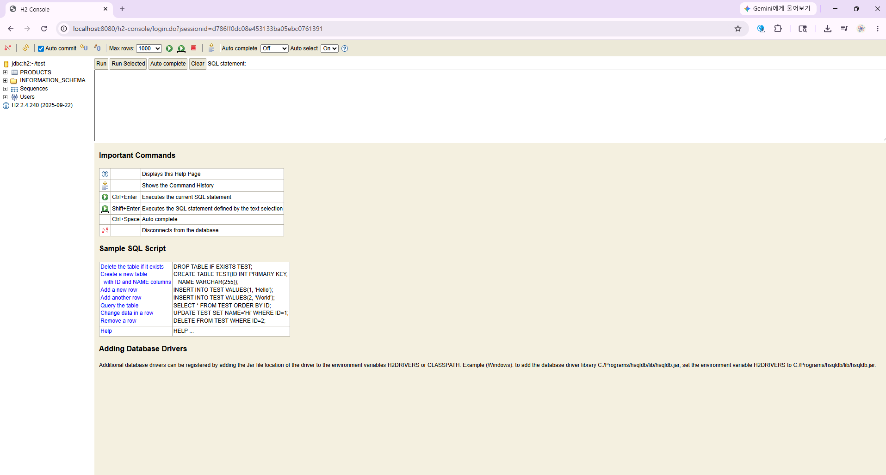

# Week 05 - 웹의 동작 원리와 Spring Boot CRUD API

이번 주차에는 웹이 어떻게 동작하는지 배우고, Spring Boot로 상품 정보를 다루는 API를 실습했습니다.

---

## 학습 내용

| 구분 | 정리 |
|---|---|
| 웹 동작 원리 | 요청을 보내고 응답을 받는 구조 |
| 클라이언트 / 서버 | 사용하는 쪽과 처리하는 쪽 |
| HTTP / URL | 웹에서 약속된 통신 방식과 주소 |
| 쿠키 | 로그인 상태처럼 필요한 정보를 브라우저에 저장 |
| 네트워크 | IP, 포트, DNS |
| Spring Boot | Java로 웹 서비스를 만드는 도구 |
| CRUD | 생성, 조회, 수정, 삭제 |
| H2 Database | 실습용 데이터베이스 |

---

## 웹 기본 개념

| 개념 | 설명 |
|---|---|
| 클라이언트 | 요청을 보내는 쪽 |
| 서버 | 요청을 처리하고 응답하는 쪽 |
| HTTP | 웹에서 데이터를 주고받는 약속 |
| URL | 웹 페이지나 데이터의 주소 |

```text
Client -> Request -> Server
Client <- Response <- Server
```

URL은 프로토콜, 호스트, 경로로 나누어 볼 수 있습니다.

```text
https://www.google.com/search
```

| 구성 요소 | 예시 |
|---|---|
| 프로토콜 | `https://` |
| 호스트 | `www.google.com` |
| 경로 | `/search` |

---

## 쿠키

HTTP는 이전 요청을 계속 기억하지 않습니다.  
그래서 로그인 상태처럼 필요한 정보를 유지할 때 쿠키를 사용할 수 있습니다.

| 구분 | 설명 |
|---|---|
| 쿠키 | 브라우저에 저장되는 작은 데이터 |

---

## 네트워크 기초

| 개념 | 설명 |
|---|---|
| IP | 컴퓨터를 찾기 위한 주소 |
| 포트 | 컴퓨터 안에서 서비스를 구분하는 번호 |
| DNS | 도메인 이름을 IP 주소로 바꿔주는 것 |
| localhost | 내 컴퓨터를 가리키는 주소 |

```text
localhost:8080
```

---

## Spring Boot 프로젝트 생성


| 설정 | 내용 |
|---|---|
| Project | Gradle - Groovy |
| Language | Java |
| Packaging | Jar |
| Java | 17 |
| Dependencies | Spring Web, Spring Data JPA, H2 Database |

---

## Spring Boot와 MVC

Spring Boot를 사용해 요청을 받고, 로직을 처리하고, 데이터베이스와 연결하는 흐름을 실습했습니다.

```text
Client
  -> Controller
  -> Service
  -> Repository
  -> H2 Database
```

| 계층 | 역할 |
|---|---|
| Controller | 요청을 받음 |
| Service | 기능을 처리함 |
| Repository | 데이터베이스와 연결함 |
| Database | 데이터를 저장함 |

---

## Product CRUD API 실습

상품 데이터를 생성, 조회, 수정, 삭제하는 API를 만들었습니다.

| 기능 | HTTP Method | 경로 |
|---|---|---|
| 생성 | `POST` | `/api/products` |
| 조회 | `GET` | `/api/products/{id}` |
| 수정 | `PUT` | `/api/products/{id}` |
| 삭제 | `DELETE` | `/api/products/{id}` |

요청 데이터 예시는 다음과 같습니다.

```json
{
  "name": "책상",
  "characteristic": "나무",
  "price": 140000
}
```

---

## H2 Database 확인

Spring Boot 실행 후 브라우저에서 H2 콘솔에 접속해 데이터베이스를 확인했습니다.

```text
http://localhost:8080/h2-console
```



---

## 이번 주차 정리

이번 주차에는 웹의 기본 흐름인 요청과 응답 구조를 배웠습니다.

또한 Spring Boot로 Product CRUD API를 만들면서 Controller, Service, Repository, Database가 어떤 순서로 연결되는지 실습했습니다.

---

## 느낀점

이번 과제에서 가장 어려웠던 점은 코드 구현보다 실행 환경을 맞추는 과정이었습니다.

처음에는 강의 파일을 그대로 열면 바로 실행될 것이라고 생각했지만, Gradle 설정과 프로젝트 구조가 맞지 않으면 오류가 발생할 수 있다는 것을 알게 되었습니다.

특히 Spring Boot에서는 Java 파일만 있는 것이 아니라, `build.gradle`, 패키지 경로, 메인 클래스 위치가 함께 맞아야 정상적으로 실행된다는 점을 확인했습니다.

내용이 처음에는 어렵고 따라가기 힘들었지만, 모든 코드를 완벽하게 이해하기보다는 Controller, Service, Repository, Entity가 서로 연결되어 동작하는 흐름을 먼저 이해하려고 했습니다.

문제를 해결하는 과정에서는 비슷한 실습을 먼저 정리한 다른 사람의 README 파일도 참고하면서 프로젝트 구조를 이해하는 데 도움을 받았습니다.

이번 실습을 통해 API를 만드는 과정뿐만 아니라, 프로젝트를 어떻게 만들고 실행하는지도 중요하다는 것을 느꼈습니다.
